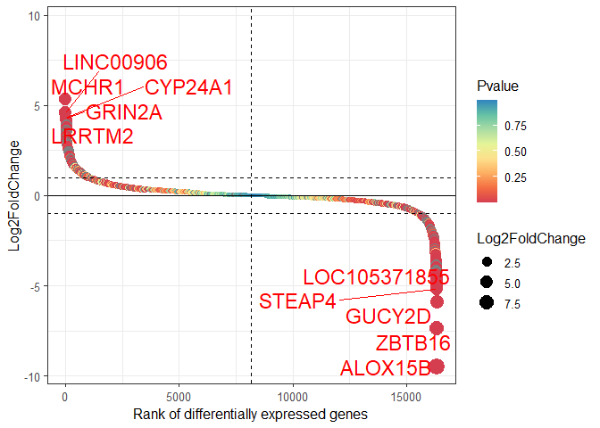
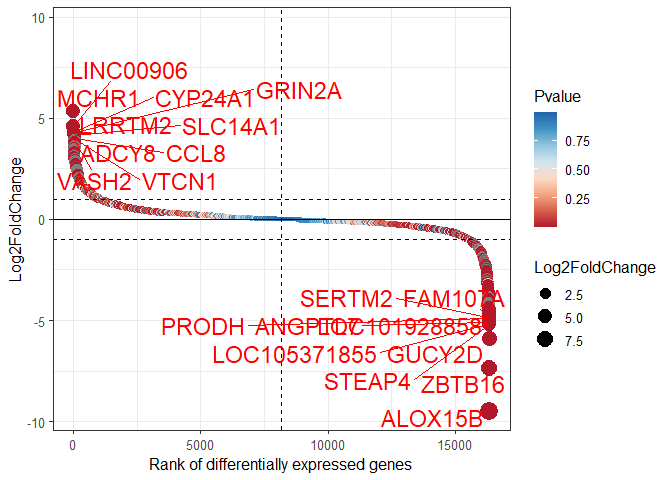
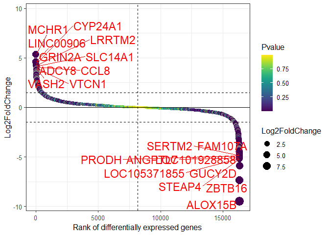

<!-- README.md is generated from README.Rmd. Please edit that file -->

# generankplot

<!-- badges: start -->

<!-- badges: end -->

The goal of generankplot is to draw gene ranking dot plot.

## Installation

You can install the released version of generankplot from
[GitHub](https://github.com/dongwei1220/generankplot) with:

``` r
devtools::install_github("dongwei1220/generankplot")
```

## Example

This is a basic example which shows you how to solve a common problem:

``` r
library(generankplot)
#> Loading required package: ggplot2
#> Warning: package 'ggplot2' was built under R version 3.6.3
#> Loading required package: ggrepel
#> Warning: package 'ggrepel' was built under R version 3.6.3
#> Loading required package: RColorBrewer

## basic example code
require(viridis)
#> Loading required package: viridis
#> Warning: package 'viridis' was built under R version 3.6.3
#> Loading required package: viridisLite
#> Warning: package 'viridisLite' was built under R version 3.6.3
data(diff_express)
head(diff_express)
#>       gene      log2FC     pvalue
#> 1   TSPAN6  0.38122716 0.00128920
#> 2     DPM1 -0.20684026 0.19492910
#> 3    SCYL3 -0.03795417 0.90990072
#> 4 C1orf112  0.08853136 0.89299439
#> 5      CFH -0.42642446 0.00002060
#> 6    FUCA2  0.24104304 0.03346006

generankplot(diff_express,top_n = 5)
```



``` r
generankplot(diff_express,top_n = 10,palette = "RdBu")
```



``` r
p <- generankplot(diff_express,top_n = 10,log2fc = 1.5)
p + scale_color_viridis()
#> Scale for 'colour' is already present. Adding another scale for 'colour',
#> which will replace the existing scale.
```



## Support
If you have any questions, or found any bug in the program, please write to us at dongw26@mail2.sysu.edu.cn
